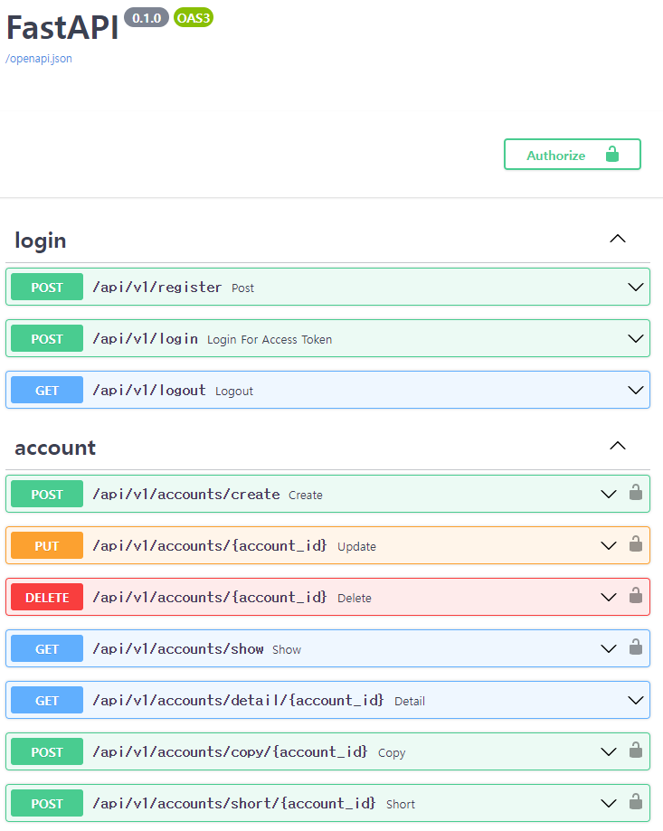

# Payhere

1. [**ERD & API & 폴더구성 소개**](#1)
2. [**요구사항 별 코드 설명**](#2)
3. [**미구현 및 회고**](#3)

<div id="1"></div>

### ERD


- **User** : email 과 password 컬럼으로 이메일, 비밀번호 정보를 받았습니다.
- **Account** : **가계부** 테이블로, user_id (외래키)로 User 테이블에 id랑 연결했습니다. money, memo 컬럼으로 상세 내용 기록했고 `share` 컬럼을 두어 단축URL 유효시간을 기록했습니다

### API 문서



| 분류  | 기능        | Method | URI                           | jwt | Request DTO                                             | State Code                    | Response DTO                                                   | 비고                                       |
|:---:|:---------:|:------:|:-----------------------------:|:---:|:-------------------------------------------------------:|:-----------------------------:|:--------------------------------------------------------------:|:----------------------------------------:|
| 회원  | 회원가입      | POST   | /register                     | X   | {<br>username(String)<br>password(String)<br>}          | 200 성공<br>400 있는 유저           |                                                                |                                          |
| 회원  | 로그인       | POST   | /login                        | X   | {<br>username(String)<br>password(String)<br>}          |                               | {<br>access_token(String)<br>token_type(String: "bearer")<br>} | json 형식이 아닌 form 형식                      |
| 회원  | 로그아웃      | GET    | /logout                       | O   |                                                         |                               |                                                                | 미구현                                      |
| 가계부 | 가계부 생성    | POST   | /accounts/create              | O   | {<br>money(Int)<br>memo(String)<br>}                    | 201 성공<br>401 권한없음            | null                                                           |                                          |
| 가계부 | 가계부 수정    | PUT    | /accounts/{account_id}        | O   | account_id(Int)<br>{<br>money(Int)<br>memo(String)<br>} | 200 성공<br>401 없는 가계부 or 권한 없음 | null                                                           |                                          |
| 가계부 | 가계부 삭제    | DELETE | /accounts/{account_id}        | O   | account_id(Int)                                         | 204 성공<br>401 없는 가계부 or 권한 없음 | null                                                           |                                          |
| 가계부 | 목록 조회     | GET    | /accounts/show                | O   | null                                                    | 200 성공401 권한 없음               | [{money(Int)<br>memo(String)<br>}...]                          | json 들의 리스트 반환                           |
| 가계부 | 상세 조회     | GET    | /accounts/detail/{account_id} | △   | account_id{Int}                                         | 200 성공<br>401 없는 가계부 or 권한 없음 | {<br>money(Int)<br>memo(String)<br>}                           | 단축URL 생성으로 인한 share 컬럼 시간생성되면<br>jwt 불필요 |
| 가계부 | 세부 내역 복제  | POST   | /accounts/copy/{account_id}   | O   | account_id(Int)                                         | 200 성공<br>401 없는 가계부 or 권한없음  | {<br>money(Int)<br>memo(String)<br>}                           |                                          |
| 가계부 | 단축 URL 생성 | POST   | /accounts/short/{account_id}  | O   | account_id(Int)                                         | 200 성공<br>401 없는 가계부 or 권한없음  | url(String)                                                    | pyshorteners 모듈                          |

### 폴더구성
- `api`: 기본 RestAPI
    - `api_v1`: `api` 에서 전체 router , `depends` 에서 유효토큰 검사
    - `endpoints`: 최종 uri 에 대한 crud
- `core`: `config`에서 pydantic > BaseSettings 활용 env 파일 정보 읽기, `securtiy`에서  jwt 토큰 생성 및 비밀번호 암호화
- `db`: db 연결
- `models`: db의 스키마에 대한 정보
- `schemas`: pydantic > BaseModel 활용 DTO 객체 설정

#### env 파일
```
NAME=root  
PASSWORD=root  
HOST=127.0.0.1  
PORT=3306  
LOCAL=8000  
DATABASE=payhere  
SECRET_KEY=35abbc264a90f49e32c9631e96914e2041a39e5a35909bdb522cf875e42d2be8
```
---

<div id="2"></div>

### 요구사항

> JWT 토큰을 발행해서 인증을 제어하는 방식으로 구현해주세요<br>
> 비밀번호는 암호화되어 저장되어야 합니다.
```python
# core > security.py
# 비밀번호 암호화 함수
pwd_context = CryptContext(schemes=["bcrypt"], deprecated="auto")

# JWT 생성
def create_access_token(subject: Union[str, Any], expires_delta: timedelta = None) -> str:
    expire = datetime.utcnow()
    if expires_delta:
        expire += expires_delta
    else:
        expire += timedelta(minutes=settings.ACCESS_TOKEN_EXPIRE_MINUTES)
    to_encode = {"exp": expire, "sub": str(subject)}
    encoded_jwt = jwt.encode(to_encode, settings.SECRET_KEY, algorithm=settings.ALGORITHM)
    return encoded_jwt
```
<br>

> 로그인하지 않은 고객은 가계부 내역에 대한 접근 제한 처리가 되어야 합니다.  
```python
# api > api_v1 > depends.py
from fastapi import Depends, HTTPException, status
from fastapi.security import OAuth2PasswordBearer
from jose import jwt
from pydantic import ValidationError
from sqlalchemy.orm import Session

from payhere.core.config import settings
from payhere.models.user import User
from payhere.schemas.token import TokenPayload

reusable_oauth2 = OAuth2PasswordBearer(tokenUrl=f"{settings.API_V1_STR}/login")

# ...get_db 중략...

# 이 함수를 Depends로 불러와서 권한 확인합니다
def get_current_user(db: Session = Depends(get_db), token: str = Depends(reusable_oauth2)) -> User:
    try:
        payload = jwt.decode(
            token, settings.SECRET_KEY, algorithms=[settings.ALGORITHM]
        )
        token_data = TokenPayload(**payload)
    except (jwt.JWTError, ValidationError):
        raise HTTPException(
            status_code=status.HTTP_403_FORBIDDEN,
            detail="토큰이 이상합니다",
        )
    user = db.query(User).filter(User.email == token_data.sub).first()
    if not user:
        raise HTTPException(
            status_code=404,
            detail="유저가 없어!",
        )
    return user
```
<br>

> 로그인
```python
# api > api_v1 > endpoints > login.py
# OAuth2PasswordRequestForm 으로 받았습니다
@router.post("/login")
async def login_for_access_token(user: OAuth2PasswordRequestForm = Depends(), db: Session = Depends(get_db)):
```
<br>

> 가계부의 특정 세부 내역을 공유할 수 있게 단축 URL을 만들 수 있습니다.<br>
(단축 URL은 특정 시간 뒤에 만료되어야 합니다.)
```python
# api > api_v1 > endpoints > account.py
import datetime as dt
from fastapi import Depends, status, HTTPException
from sqlalchemy.orm import Session
# 단축 url 생성 모듈
import pyshorteners

from payhere.db.session import get_db
from payhere.api.depends import get_current_user
from payhere.models.user import User
from payhere.models.account import Account
from payhere.core.config import settings


@router.post("/short/{account_id}")
def short(account_id: int, user: User = Depends(get_current_user), db: Session = Depends(get_db)):
    db_acc = db.query(Account).filter(Account.id == account_id, user.id == Account.user_id).first()
    if not db_acc:
        raise HTTPException(
            status_code=status.HTTP_401_UNAUTHORIZED,
            detail="없는 가계부이거나 권한 없음",
        )
    # 단축 URL 설정
    s = pyshorteners.Shortener()
    url = s.clckru.short(f"http://{settings.HOST}:{settings.LOCAL}{settings.API_V1_STR}/accounts/detail/{account_id}")
    # 현재부터 5분 뒤의 시간 측정 후 share 컬럼 수정
    db_acc.share = dt.datetime.now() + dt.timedelta(minutes=5)
    db.add(db_acc)
    db.commit()
    db.refresh(db_acc)
    return url
```
```python
@router.get("/detail/{account_id}", response_model=AccountList, response_model_include={"money", "memo"},
            status_code=status.HTTP_200_OK)
def detail(account_id: int, user: User = Depends(check_token), db: Session = Depends(get_db)):
    db_share = db.query(Account).filter(Account.id == account_id).first()
    # share 컬럼이 존재하고 유효한 시간인지?
    if db_share and db_share.share and db_share.share >= dt.datetime.now():
        return db_share
    # 단축 url 유효하지 않은 상황
    # 없는 user 인지?
    if not user:
        raise HTTPException(
            status_code=status.HTTP_401_UNAUTHORIZED,
            detail="없는 가계부이거나 권한 없음",
        )
    db_detail = db.query(Account).filter(Account.id == account_id, user.id == Account.user_id).first()
    # 가계부 권한 있는지?
    if not db_detail:
        raise HTTPException(
            status_code=status.HTTP_401_UNAUTHORIZED,
            detail="없는 가계부이거나 권한 없음",
        )
    return db_detail
```
`@router.get("/detail/{account_id}"` 모든 가계부에 대한 접근은 jwt 인증을 필요로 하기에 `api > depends.py` 에 router 설정시 
`dependencies`를 추가했습니다<br> 그러나 **단축 공유url**로 들어온 경우 jwt인증이 불필요해서 가계부 상세보기 페이지에 jwt 인증에 대해 고민해봤습니다.<br>
그 결과 url에 들어온 경우 jwt 인증이 아닌 공유url의 시간이 유효한지 먼저 체크했습니다. 그 이후 jwt 인증을 했습니다.<br>
단축 url에 대한 api 접근에 대한 다른 방법이 있을지 궁금합니다.<br>
1. 하나의 uri 에서 처리하는 방법이라면 코드의 짜임새는 어떻게 해야하는지
2. 가계부 세부 내역 조회 api를 2개 작성하는지(jwt 인증, 공유용 정보) 만약 이 경우 단축 url을 클릭하면 같은 uri로 이동하는데 이 문제는 어떻게 해결될 수 있는지
<br>
> DB 관련 테이블에 대한 DDL 파일을 소스 디렉토리 안에 넣어주세요. 

DDL 폴더 내에 두 테이블의 DDL 정보를 `.sql`파일로 넣었습니다 (mysql workbench에서 export한 파일)
> 가능하다면 테스트 케이스를 작성해주세요. 

`test_main.py`에 15개의 함수로 테스트 했습니다.
```python
from fastapi.testclient import TestClient

from main import app


client = TestClient(app)
header = {}

# 1. 회원가입
def test_register():
# 2. 같은 이메일로 회원가입시도
def test_register_exist_username():
# 3. 틀린 비밀번호로 로그인시도
def test_login_wrong_password():
# 4. 로그인
def test_login():
# 5. 가계부 생성
def test_accounts_create():
# 6. 가계부 수정
def test_accounts_update():
# 7. 권한없는 가계부 수정
def test_accounts_update_wrong_id():
# 8. 가계부 삭제
def test_accounts_delete():
# 9. 권한없는 가계부 삭제
def test_accounts_delete_wrong_id():
# 10. 가계부 목록 조회
def test_accounts_show():
# 11. 가계부 복제
def test_accounts_copy():
# 12. 가계부 상세 조회
def test_accounts_detail():
# 13. 토큰 없이 가계부 상세 조회
def test_accounts_detail_without_token_1():
# 14. 단축 url 생성
def test_accounts_short():
# 15. 토큰 없이 가계부 상세 조회 (단, 단축 url 유효해서 접근 가능해야함)
def test_accounts_detail_without_token_2():
```

- 15번의 테스트 모두 passed 확인했습니다.
- test code를 [공식문서](https://fastapi.tiangolo.com/tutorial/testing/) 보며 처음 코딩해보았습니다.(이런식으로 하는게 맞나요?)
---
<div id="1"></div>

### 미구현 및 회고
<br>

#### 미구현

- logout을 못했습니다. 2단계로 구상했었습니다.<br>1. header에 토큰 삭제 / 2. db에 썼던 토큰 저장<br>1번의 header에서 토큰 삭제하는 방법을 
찾지 못했습니다. 2단계는 토큰 만료 삭제 후 Redis에 정보를 저장하는게 효율적이라고 이번에 배웠습니다.

#### 배운 점

- 로그인 시 올바른 명칭으로 넘어와야 토큰작업을 할 수 있었습니다. <br>`OAuth2PasswordRequestForm`form 형식으로 받았기 때문에 기존 json 방식이 아닌 
form 형식으로 받아야 했고 testing 때도 client 내에 파라미터를 `json`이 아닌 `data`에 담았습니다.
- testing 시 access_token을 다음 함수에 가지고 가기위해 global 전역변수를 사옹했습니다.
- 단축 url 을 생성해주는 `pyshorteners` 모듈을 처음 접했습니다.

#### 궁금한 점

- `api_router`에 `dependencies` 추가하면 한 router 내에 모든 함수에 `Depends()` 쓸 필요가 없었습니다.<br>
`detail/{}` 처럼 단 하나의 함수가 jwt 인증이 필요없다면 그 하나를 위해서 `dependencies` 쓰지않고 (모든함수 - 1개) 에 전부 `Depends`를 달았습니다.<br>
다른 방법이 있는지?
- 공식문서에 testing 부분에 대해 설명이 충분하지 못하다고 느꼈습니다(?) `test_main.py`를 그런식으로 구성하고 테스트하는게 유의미한지..?

#### 시간이 더 있다면?

- 빠른 test 위해 api 폴더 내에 crud 쿼리를 따로 폴더로 분리하지 않았습니다 분리해서 더 깔끔하게 구성해보고 싶습니다
- `/detail` 에 단축 url에 따른 쿼리 추가로 작성하느라 클린한 모습이 아닙니다
- 가계부 상세 정보에 생성시간 추가해서 정렬기능
- 가계부 상세 정보에 **카테고리**를 추가하고 `seaborn`같은 걸 써서 원형 차트 그려보고 싶습니다